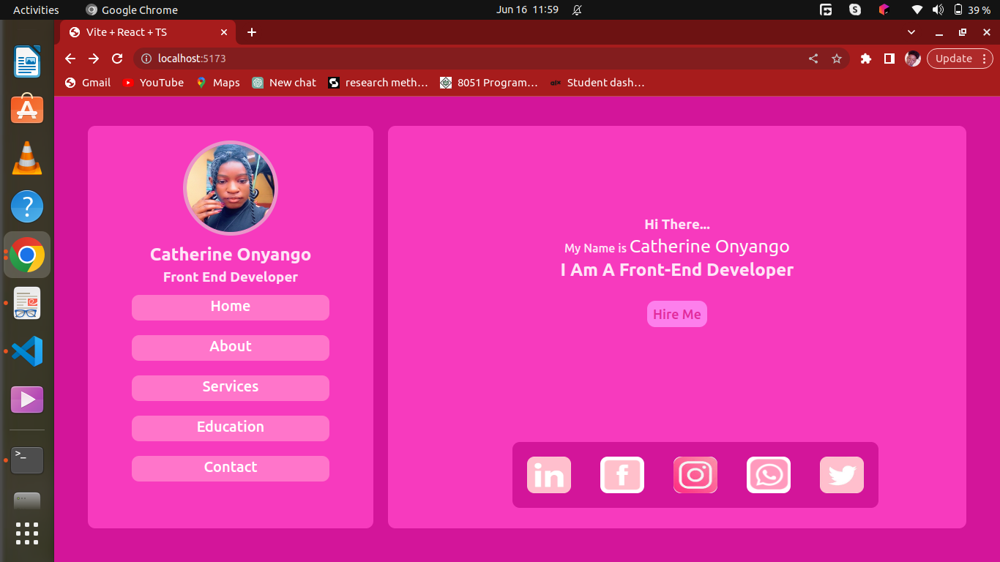

# My Portfolio

This is a portfolio website showcasing my projects and skills. It provides an overview of my experience, education, and contact information.

## Table of Contents

- [Demo](#demo)
- [Technologies Used](#technologies-used)
- [Features](#features)
- [License](#license)
- [Contact](#contact)

## Demo

Below is a screenshots/gif to showcase its appearance and functionality.

## Technologies Used

- HTML
- CSS
- JavaScript
- Typescript
- [Library/Framework Name](link) - React , Vite

List of technologies and tools i used to develop my portfolio website.

## Features

-Main features and functionalities to my portfolio website.

1. About Me/Introduction
2. Projects Showcase
3. Skills and Expertise
4. Resume/CV: Include a downloadable my resume or curriculum vitae (CV)
5. Contact Information
6. Responsive Design: It optimized for different screen sizes and devices. This makes it accessible and visually appealing to visitors using desktop computers, laptops, tablets, or mobile devices.

7. Social Media Integration:It Include links or buttons to my social media profiles, such as LinkedIn, GitHub.

## License

This project is licensed under the [MIT License](LICENSE.md).

## Contact

If someone wants to reach out to me regarding my portfolio or any inquiries, below are my contact information.

- Name: Catherine Onyango
- Email: achiengcatherine431@gmail.com
- LinkedIn: [My  LinkedIn Profile](https://www.linkedin.com/in/catherine-onyango-08101b220/)
- Portfolio: [My Portfolio Website](https://www.my-portfolio.com) #### yet to be added

